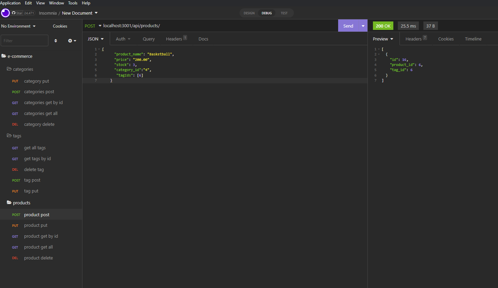

# e-commerce


## Deployed link
no deployed link but here is a link to a video showing its use https://drive.google.com/file/d/1e0gxx0SbKX20tehHIOPQ0zL-KArxDO-r/view

## site picture



## Technologies Used
- JavaScript : Used to give the page logical functions and a dynamic interface
- Git : Used to version control the code during the creation process
- GitHub : hosting the repositroy responsible for the website

## Authors
- writen styled and built by Mason Davis

## summary
This repository contains all the code to generate api calls to collect data on products and tages that fall under specific cameras. it does not contain any front end user interface and relies heavily on insomnia to see its practicality. 

## Code Snippet
This is a snippet Showing the formula used to generate the call used to delete a category.

```javaScript
   router.delete('/:id', async (req, res) => {
  try {
    const catergoryData = await Category.destroy({where: {id: req.params.id}});

    if (!catergoryData) {
      res.status(404).json({ message: 'No catergory found with that id!' });
      return;
    }

    res.status(200).json("deleted succesfully");
  } catch (err) {
    res.status(500).json(err);
  }
});
```


## Author links
[LinkedIn](https://www.linkedin.com/in/davis-mason-t/)
[GitHub](https://github.com/Md7113)